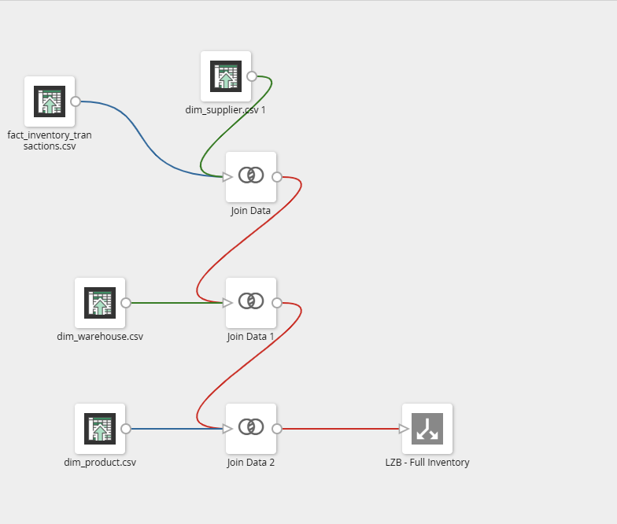
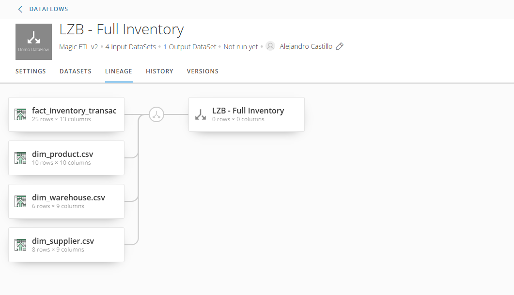
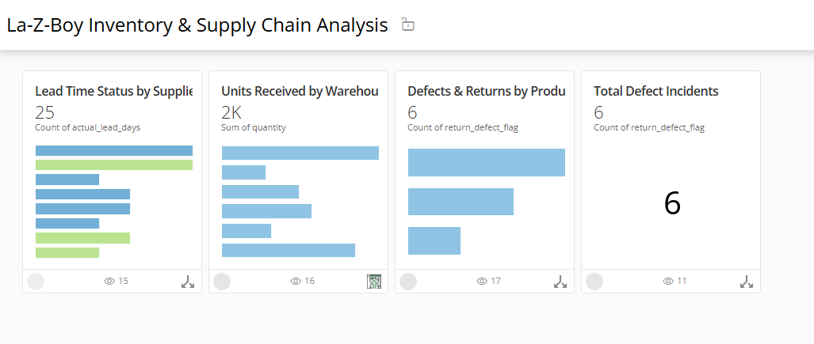
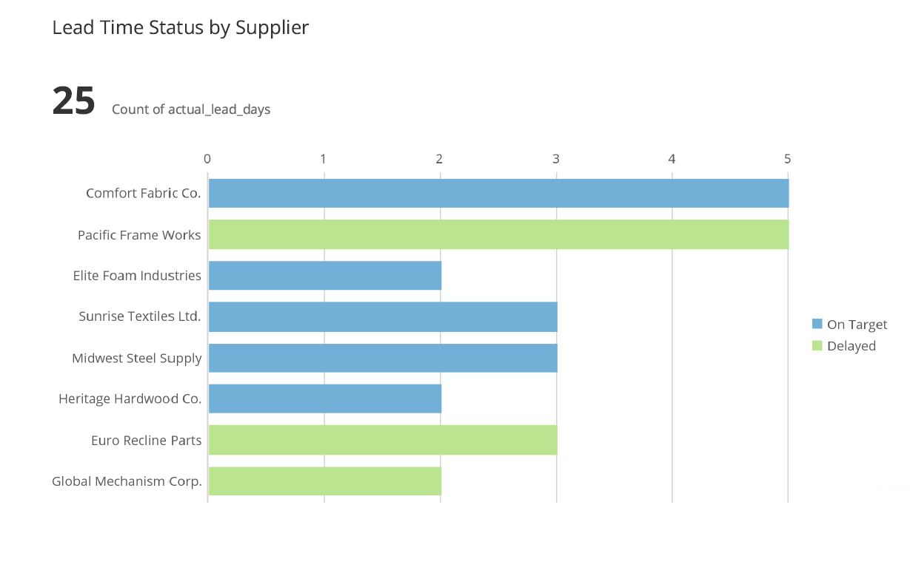
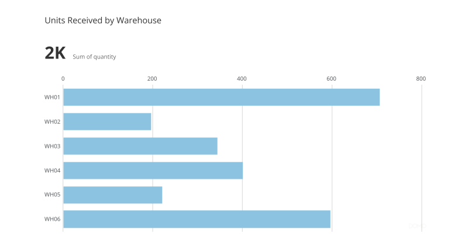
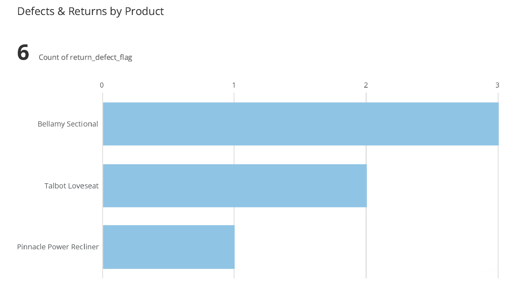

# Inventory & Supply Chain Analytics (Domo)

## Overview  
This project focuses on analyzing supply chain data using Domo. The goal was to build a complete data pipeline and create dashboards to track supplier performance, warehouse activity, and product quality.

---

## Data Pipeline (Domo Magic ETL)
- Built a dataflow using Domo Magic ETL  
- Combined multiple datasets into one unified dataset  
- Joined:
  - fact_inventory_transactions  
  - dim_supplier  
  - dim_product  
  - dim_warehouse  
- Output dataset: **LZB Full Inventory**

### DataFlow Diagram  

---

## Data Lineage  
Shows how datasets are connected from source to final output.  

---

## Dashboard Overview  

---

## Dashboard & Visualizations

### Lead Time by Supplier  
Shows how long suppliers take to deliver and whether they are on time or delayed.  

---

### Units Received by Warehouse  
Displays how inventory is distributed across warehouses.  

---

### Defects & Returns by Product  
Highlights which products have the most defects or returns.  

---

### Total Defects  
Shows overall defect count to quickly understand product quality issues.

---

## Key Insights
- Some suppliers have longer lead times, which may impact operations  
- Certain products show higher defect rates and may need review  
- Inventory distribution varies across warehouses  

---

## Notes
Dashboard is hosted in Domo and is not publicly accessible. Screenshots are provided to demonstrate functionality.
